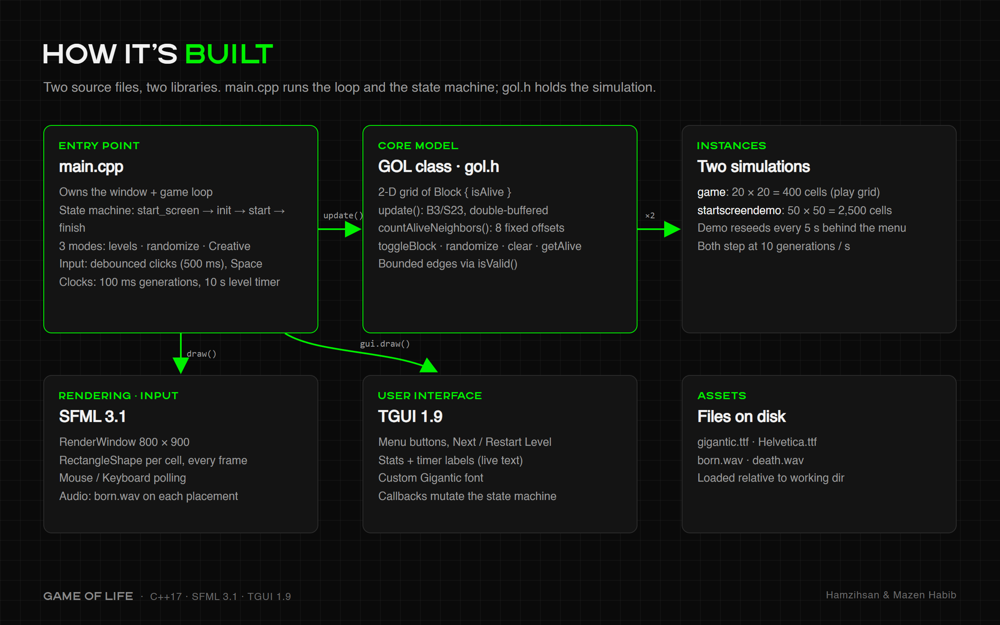
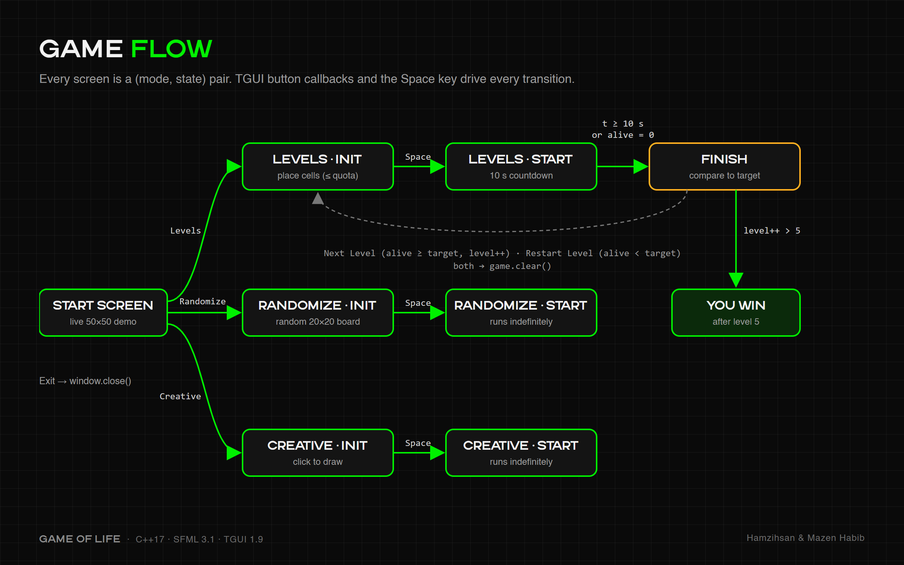
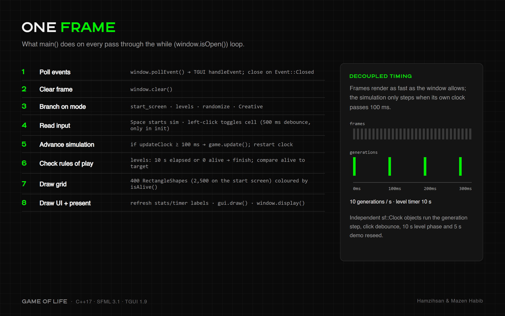
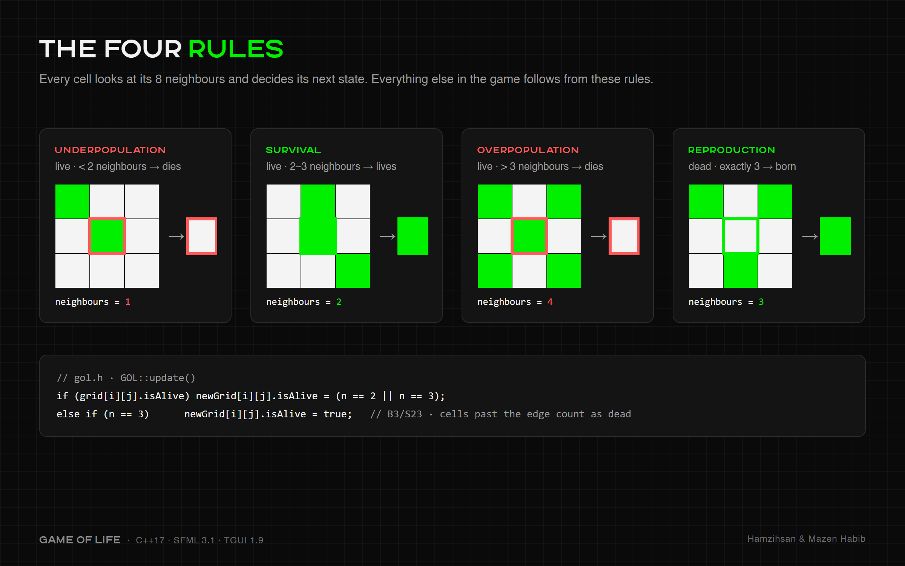
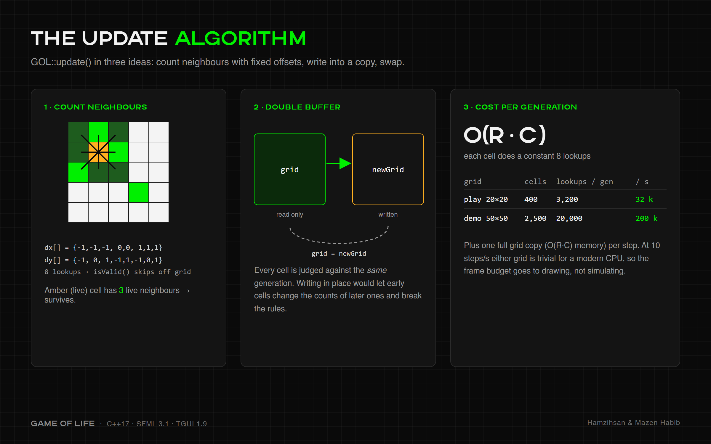
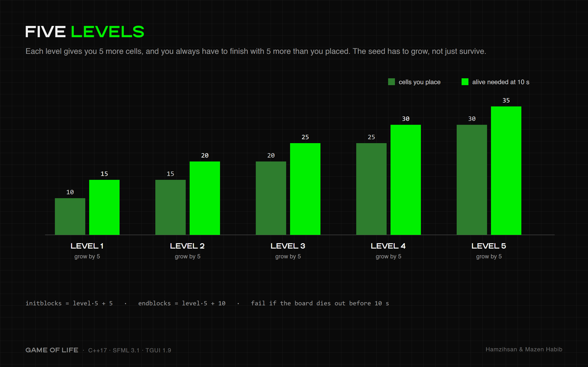
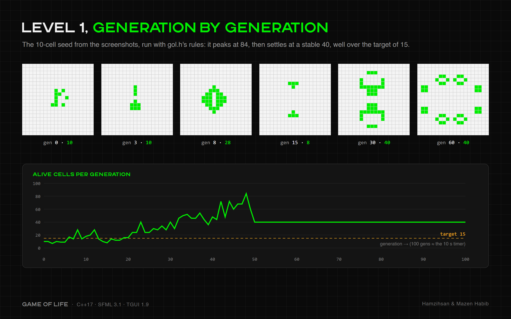
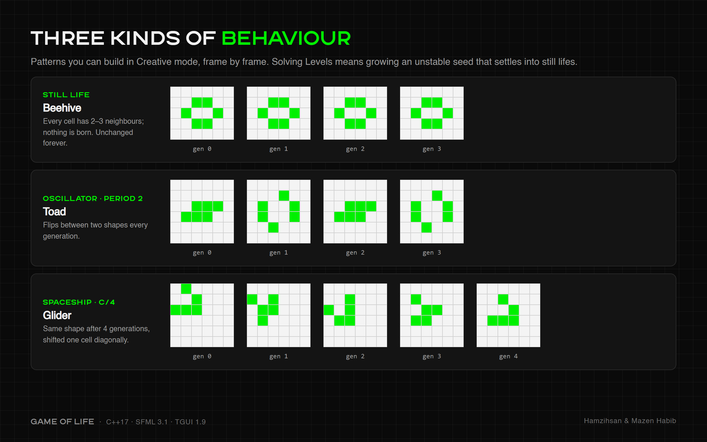

# Game of Life - Interactive Implementation

A feature-rich implementation of Conway's Game of Life using C++, SFML, and TGUI with multiple game modes and interactive gameplay.

**Made by Hamzihsan and [Mazen Habib](https://github.com/Mazen-Habib)**

## Overview

This project implements Conway's Game of Life, a cellular automaton where cells evolve based on simple rules. The game features three distinct modes: a level-based challenge system, a randomized mode, and a creative sandbox mode.

## How It Works

### Architecture

Two source files and two libraries: `main.cpp` runs the window, game loop and state machine, and `gol.h` holds the simulation.



### Game Flow

Every screen is a (mode, state) pair. Menu buttons, the Space key and the 10-second level timer move the game between them.



### One Frame of the Game Loop



### The Rules



### The Update Algorithm

Neighbours are counted with fixed offset arrays, results are written into a copy of the grid, and the copy replaces the grid. Each generation costs O(rows × cols).



### Levels



A Level 1 solution, simulated generation by generation: 10 cells grow to a peak of 84, then settle at a stable 40, well over the target of 15.



### Pattern Behaviours



## Features

### Game Modes

1. **Levels Mode**
   - 5 progressively challenging levels
   - Objective: Place a specific number of cells to achieve a target population after 10 seconds
   - Each level requires more cells (Level 1: 10 cells → 15 cells, Level 5: 30 cells → 35 cells)
   - Real-time timer and statistics display
   - Win/restart functionality based on success criteria

2. **Randomize Mode**
   - Start with a randomly generated grid
   - Observe the evolution of random patterns
   - Interactive: Add/remove cells while simulation is running
   - Blue cells indicate living cells
   - Continuous gameplay with no time limits

3. **Creative Mode**
   - Design custom cell patterns
   - Press Space to start simulation
   - Visual feedback: Red cells indicate "still life" patterns (stable configurations)
   - Green cells for normal living cells
   - Perfect for experimenting with Game of Life patterns

### Technical Features

- **Interactive Grid**: Click to toggle cells on/off
- **Visual Effects**: Color-coded cells (Green/Blue/Red) based on state and mode
- **Sound Effects**: Audio feedback when placing cells (born.wav, death.wav)
- **Animated Start Screen**: Background Game of Life animation
- **Real-time Statistics**: Track alive cells, level progress, and time remaining
- **Optimized Updates**: Two update algorithms - standard (O(n²)) and slow (O(n⁴)) for analysis

## Game Rules (Conway's Game of Life)

1. **Underpopulation**: A live cell with fewer than 2 neighbors dies
2. **Survival**: A live cell with 2-3 neighbors survives
3. **Overpopulation**: A live cell with more than 3 neighbors dies
4. **Reproduction**: A dead cell with exactly 3 neighbors becomes alive

## Project Structure

```
DAA-PRJ/
├── main.cpp           # Main game logic and UI implementation
├── gol.h              # Game of Life core class and algorithms
├── install.sh         # Dependency installation script
├── game               # Compiled executable
├── SFML/              # SFML library (version 3.1)
├── TGUI/              # TGUI library (version 1.9.0)
├── gigantic.ttf       # Custom font for UI
├── Helvetica.ttf      # Alternative font
├── born.wav           # Sound effect for cell birth
└── death.wav          # Sound effect for cell death
```

## Dependencies

- **SFML 3.1**: Graphics, window management, and audio
- **TGUI 1.9.0**: GUI framework for buttons, labels, and UI elements
- **C++ Standard Library**: STL containers and algorithms

## Installation

### Prerequisites
- Linux (Ubuntu/Debian-based recommended)
- GCC/G++ compiler with C++17 support
- CMake, Git, and build-essential tools

### Quick Install

Run the provided installation script:

```bash
./install.sh
```

This script will:
1. Update package repositories
2. Install SFML development libraries
3. Clone and build TGUI from source
4. Configure system libraries

### Manual Installation

If you prefer manual installation:

```bash
# Update system
sudo apt update

# Install SFML
sudo apt install -y libsfml-dev cmake git build-essential

# Build TGUI
cd /tmp
git clone https://github.com/texus/TGUI.git
cd TGUI
mkdir build && cd build
cmake -DTGUI_BACKEND=SFML_GRAPHICS ..
make -j$(nproc)
sudo make install
sudo ldconfig
```

## Building the Project

If you need to rebuild from source:

```bash
g++ -std=c++17 main.cpp -o game \
    -I./SFML/include -I./TGUI/include \
    -L./SFML/build/lib -L./TGUI/lib \
    -lsfml-graphics -lsfml-window -lsfml-system -lsfml-audio \
    -ltgui -lpthread
```

## Running the Game

Due to custom library paths, use the following command:

```bash
export LD_LIBRARY_PATH=$LD_LIBRARY_PATH:./SFML/build/lib:./TGUI/lib && ./game
```

Or create an alias in your `.bashrc`:

```bash
alias rungame='cd ~/Desktop/Uni/DAA-PRJ && export LD_LIBRARY_PATH=$LD_LIBRARY_PATH:./SFML/build/lib:./TGUI/lib && ./game'
```

## Controls

- **Mouse Left Click**: Toggle cells (place/remove)
- **Spacebar**: Start simulation
- **GUI Buttons**: Navigate menus and modes

## Implementation Details

### Core Algorithm (gol.h)

The `GOL` class implements the cellular automaton with:

- **Grid Management**: 2D vector of Block structures
- **Neighbor Counting**: Efficient O(1) per cell using directional arrays
- **Update Method**: Standard Game of Life rules implementation
- **Slow Update Method**: Intentionally inefficient O(n⁴) algorithm for comparison
- **Still Life Detection**: Identifies stable patterns in creative mode
- **Randomization**: Grid population with random states

### UI Implementation (main.cpp)

- **State Machine**: Manages game states (start_screen, init, start, finish)
- **Mode System**: Switches between levels, randomize, and creative modes
- **TGUI Integration**: Dynamic UI elements with custom fonts
- **SFML Rendering**: 30x30 grid with color-coded cells
- **Clock Management**: Timers for updates, delays, and level progression

### Performance Considerations

- Grid size: 30x30 (900 cells)
- Update frequency: 100ms (10 FPS)
- Click debounce: 300-500ms to prevent accidental double-clicks
- Optimized neighbor counting with static directional arrays

## Game Modes Explained

### Levels Mode Strategy
- Start with the minimum required cells
- Create patterns that grow or stabilize (gliders, blinkers, blocks)
- Common patterns: 
  - **Blinker**: 3 cells in a row (oscillates)
  - **Block**: 2x2 square (still life)
  - **Glider**: 5 cells creating a moving pattern

### Randomize Mode
- Experiment with chaos and emergent patterns
- Watch how random configurations evolve
- Add cells to create new interactions

### Creative Mode
- Design stable patterns (still lifes) shown in red
- Create oscillators and moving patterns
- Study pattern evolution without time pressure

## Known Patterns to Try

- **Blinker**: Horizontal or vertical 3-cell line
- **Toad**: Two rows of 3 cells offset by 1
- **Beacon**: Two 2x2 blocks touching diagonally
- **Glider**: Classic 5-cell moving pattern
- **Pulsar**: Large 13x13 oscillating pattern

## Troubleshooting

### Library Errors

If you encounter `error while loading shared libraries`:

```bash
# Check if libraries exist
ls SFML/build/lib/
ls TGUI/lib/

# Verify library versions
ldd ./game

# Set library path
export LD_LIBRARY_PATH=$LD_LIBRARY_PATH:./SFML/build/lib:./TGUI/lib
```

### Compilation Issues

- Ensure C++17 or later compiler support
- Verify SFML 3.1 compatibility
- Check TGUI backend matches SFML version

### Audio Issues

If sound doesn't play:
- Verify `born.wav` and `death.wav` exist in the directory
- Check system audio configuration
- SFML audio module must be linked

## Future Enhancements

- Pattern library/presets
- Save/load grid states
- Adjustable grid size
- Speed controls
- Heat map visualization
- Pattern recognition system
- Multiplayer challenges

## Credits

- **Conway's Game of Life**: John Horton Conway (1970)
- **SFML**: Simple and Fast Multimedia Library
- **TGUI**: Texus' Graphical User Interface
- Fonts: Gigantic.ttf, Helvetica.ttf

## License

This project is for educational purposes as part of a DAA (Design and Analysis of Algorithms) course project.

## Authors

Made by **Hamzihsan** and **Mazen Habib** ([@Mazen-Habib](https://github.com/Mazen-Habib)).

Developed as a university project for Design and Analysis of Algorithms course.

---

**Window Size**: 800x900 pixels  
**Grid Size**: 30x30 cells  
**Update Rate**: 100ms (10 FPS)  
**Supported Platforms**: Linux (tested on Pop!_OS/Ubuntu)
# game-of-life
